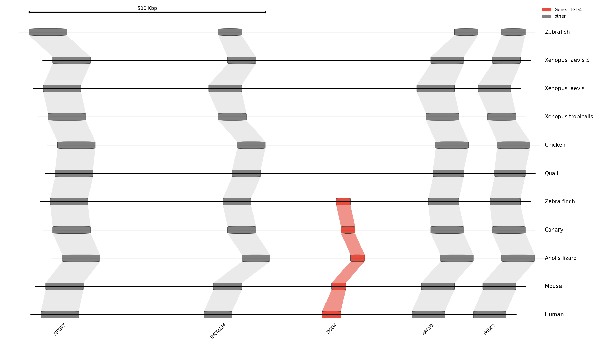

# synteny-viz

A tool for visualizing synteny - the conservation of gene order across species.

## Installation

```bash
uv sync
```

## Usage

### CLI

```bash
# Create a template configuration
uv run synteny-viz init -o my_synteny.json

# Validate JSON
uv run synteny-viz validate my_synteny.json

# Render visualization
uv run synteny-viz render my_synteny.json -o output.png

# Convert from BED files
uv run synteny-viz convert-bed human:human.bed mouse:mouse.bed -g orthogroups.tsv -H TIGD4
```

### Python API

```python
from synteny_viz import SyntenyData, render_synteny
from synteny_viz.converters import SyntenyBuilder

# Option 1: Load from JSON
data = SyntenyData.from_json_file("synteny.json")
render_synteny(data, "output.png")

# Option 2: Build programmatically
data = (
    SyntenyBuilder(title="My Synteny Plot")
    .add_species_from_bed("human", "Human", "human_genes.bed", chrom="chr4")
    .add_species_from_bed("mouse", "Mouse", "mouse_genes.bed", chrom="chr5")
    .load_orthogroups("orthogroups.tsv")
    .highlight("TIGD4", color="#e74c3c")
    .build()
)
render_synteny(data, "output.png")
```

## Data Format

### JSON Structure

```json
{
  "title": "Optional title",
  "species": [
    {
      "species_id": "human",
      "display_name": "Human",
      "genes": [
        {
          "gene_id": "hs:TIGD4",
          "name": "TIGD4",
          "chrom": "chr4",
          "start": 620000,
          "end": 660000,
          "strand": "+",
          "orthogroup": "TIGD4"
        }
      ]
    }
  ],
  "highlights": [
    {"name": "TIGD4", "color": "#e74c3c", "label": "Gene: TIGD4"}
  ],
  "style": {
    "figure_width": 16,
    "dpi": 150
  }
}
```

### Converters

**BED format:**
```
chr4    620000    660000    TIGD4    0    +
```

**GFF/GTF format:**
```
chr4    ensembl    gene    620001    660000    .    +    .    ID=TIGD4;Name=TIGD4
```

**Orthogroups (TSV):**
```
gene_name    orthogroup_id
TIGD4    OG0001
FBXW7    OG0002
```

## Example

```bash
uv run synteny-viz render examples/tigd4_synteny.json -o examples/output.png
```



## Styling

All style parameters can be configured in the `style` section of JSON:

| Parameter | Description | Default |
|-----------|-------------|---------|
| `gene_color` | Gene fill color | `#808080` |
| `link_color` | Orthology link color | `#cccccc` |
| `link_alpha` | Link transparency | `0.4` |
| `gene_height` | Gene rectangle height | `0.3` |
| `figure_width` | Figure width (inches) | `16` |
| `dpi` | Output resolution | `150` |
| `show_scale_bar` | Show scale bar | `true` |
| `show_gene_labels` | Show gene labels | `true` |
